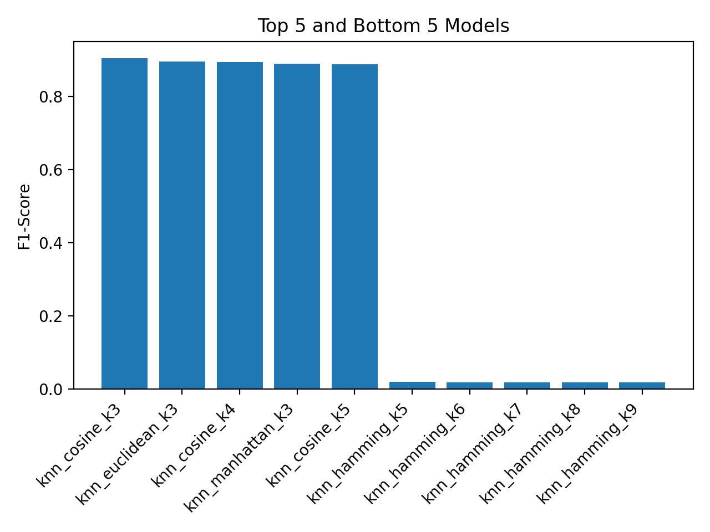
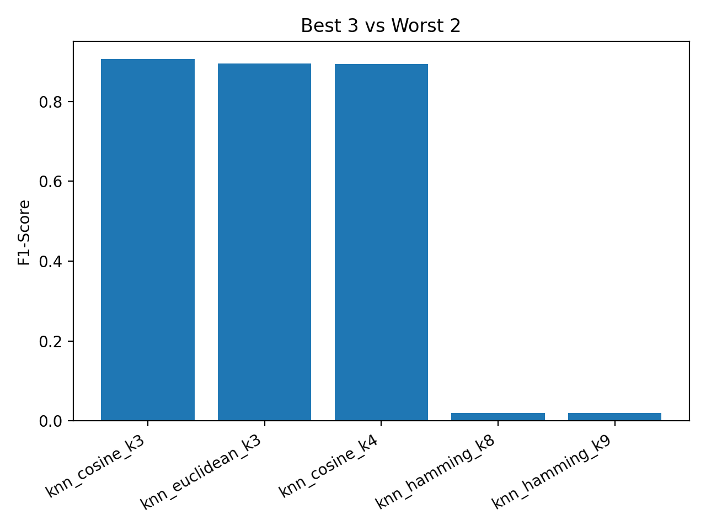
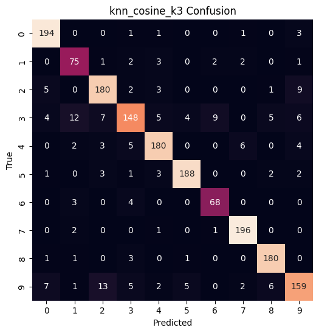
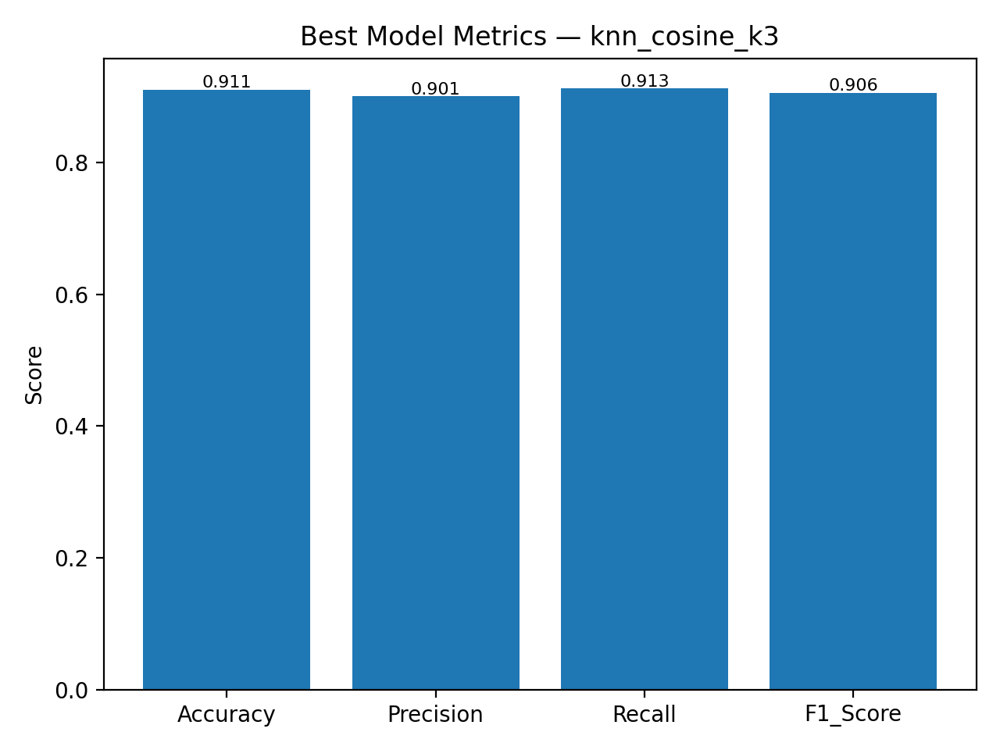
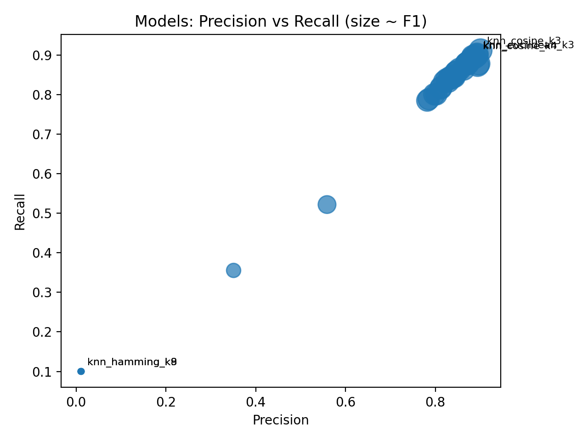

# How to Use This Repository 📘

👉 For a step-by-step quick start guide, please ctr + click 
[**how_to_use_this_repo.md**](https://github.com/balajiabcd/Urban_sound_classification/blob/main/project_reports/how_to_use_this_repo.md).  
  
👉 For a video version of project demo, please ctr + click 
[**project_demo**](https://www.youtube.com/watch?v=_YQ5DEkcp_Y).

------------------------------------------------------------------------

# 📂 Repository Structure

    notebooks
    sample_data
      ├─ fold1
      │   ├─ 7061-6-0-0.wav
      │   ├─ 7383-3-0-0.wav
      │   └─ 7383-3-0-1.wav
      ├─ fold2
      └─ UrbanSound8K.csv
    src
      ├─ extract
      ├─ training
      ├─ README_src.md
      └─ __init__.py
    static
      ├─ css
      ├─ figures
      ├─ images/images
      ├─ web_app_screenshots
      └─ metrics.csv
    templates
    tests
    .gitignore
    ML_Project_Report.docx
    ML_Project_Report.pdf
    README.md
    app.py
    hell.md
    how_to_use_this_repo.md
    info_UrbanSound8K.docx
    main.py
    pytest.ini
    requirements.txt

------------------------------------------------------------------------

# 🎶 Urban Sound Classification 

## 1. Introduction  

Urban environments are filled with a wide range of sounds — from **natural sounds** such as birds chirping and children playing, to **man-made noises** like car horns, construction drilling, or ambulance sirens. These sounds carry important contextual information but can also contribute to **noise pollution**, which negatively impacts human health and well-being.  

The goal of this project is to **automatically classify environmental sounds** into meaningful categories using machine learning techniques. By analyzing short audio clips, we can build models that distinguish between everyday sounds such as:  

- 🚨 Sirens (emergency vehicles)  
- 🐶 Dog barks  
- 🚗 Car horns and engine idling  
- 🔧 Drilling, jackhammers, and construction noise  
- 🎵 Children playing, street music  

This classification task is not only an academic challenge but also has **practical applications**:  
- **Smart cities** → monitoring noise levels and identifying sound events.  
- **Surveillance systems** → automatic detection of abnormal or dangerous sounds.  
- **Assistive technology** → helping people with hearing impairments recognize environmental cues.  
- **Urban planning & policy** → measuring and mitigating the impact of noise pollution.  

In this project, we use the **UrbanSound8K dataset** and design a **complete pipeline**:  
1. Extracting acoustic features (MFCCs, spectral descriptors).  
2. Preprocessing with scaling and PCA.  
3. Training multiple ML classifiers (KNN, Random Forest, Decision Trees, Logistic Regression).  
4. Evaluating models on standard metrics.  
5. Deploying the best pipeline as a **web application** for interactive predictions.  

------------------------------------------------------------------------

## 2. Dataset – UrbanSound8K  

The **UrbanSound8K dataset** is a widely used benchmark for environmental sound classification. It contains **8,732 labeled audio clips**, each up to 4 seconds long, organized into 10 different folds for cross-validation. The dataset covers **10 diverse classes of urban sounds**, such as air conditioners, car horns, children playing, dog barks, drilling, engine idling, gunshots, jackhammers, sirens, and street music.  

Each clip is stored as a `.wav` file, while a **metadata CSV file (`UrbanSound8K.csv`)** provides labels and additional information such as file name, fold number, and class. The fold structure allows standardized **cross-validation**, making it easy to compare results across different models and experiments. This dataset captures the **acoustic diversity and challenges of real-world environments**, including background noise, overlapping sounds, and varying recording conditions, making it ideal for testing robust classification systems.  

The dataset contains **8732 labeled `.wav` files**, organized into **10
folds** for cross-validation, and a metadata file (`UrbanSound8K.csv`).

### Example Folder Structure

    archive/
    ├─ fold1/
    ├─ fold2/
    ...
    ├─ fold10/
    └─ UrbanSound8K.csv

------------------------------------------------------------------------

## 3. Methodology

### 🔹 Step 1 – Feature Extraction  

-   Extracted **MFCCs**, Spectral Centroid, Rolloff, Bandwidth,
    Zero-Crossing Rate.\
-   Features were aggregated and stored as CSVs for training.

Feature extraction transforms raw audio signals into meaningful numerical representations. Using **Librosa**, we computed MFCCs, spectral features, and zero-crossing rates. These features capture both frequency and temporal characteristics, enabling machine learning models to effectively distinguish different categories of urban sounds.  

📊 **Feature Representation (PCA plot):**\

------------------------------------------------------------------------

### 🔹 Step 2 -- Preprocessing

-   **StandardScaler** → ensures features have mean = 0, std = 1.\
-   **PCA** → dimensionality reduction while retaining variance.

Preprocessing ensures that extracted features are normalized and optimized for learning. We applied **StandardScaler** to standardize distributions and **PCA** to reduce dimensionality while retaining variance. This step minimizes noise, avoids redundancy, and prepares consistent feature sets for robust training and evaluation.  

📈 **PCA Elbow Plot (explained variance):**\

------------------------------------------------------------------------

### 🔹 Step 3 – Model Training  

Multiple machine learning models were trained, including **KNN, Random Forest, Decision Tree, and Logistic Regression**. Each model was evaluated across different folds using accuracy and F1-score. Hyperparameter variations in KNN (neighbors and distance metrics) allowed deeper exploration of performance trade-offs across algorithms.  

📊 **Top 5 & Bottom 5 models (F1-score):**  
      
This chart highlights the strongest and weakest models based on validation F1-scores, showing clear performance differences across algorithms.  

📊 **KNN: neighbors vs F1-score (by distance metric):**  
  
This line plot illustrates how KNN performance changes with the number of neighbors (`k`) across different distance metrics, revealing that cosine and Euclidean metrics consistently outperform others.  

📊 **Summary: Best 3 vs Worst 2 models:**  
  
This summary compares the top three models with the bottom two, reinforcing why KNN with cosine distance emerged as the best choice while Hamming-based KNN performed poorly.  

✅ **In summary**, the plots demonstrate that while several models achieved competitive results, **KNN with cosine, Euclidean, and Manhattan metrics consistently led performance**, confirming its effectiveness for urban sound classification. Conversely, models using Hamming distance were highly ineffective, highlighting the importance of metric selection in KNN.  

------------------------------------------------------------------------

### 🔹 Step 4 – Evaluation  

Model performance was assessed using **Accuracy, Precision, Recall, and F1-score**. Beyond raw numbers, we visualized results to better understand strengths and weaknesses of the trained classifiers.Model performance was measured using standard metrics: **Accuracy, Precision, Recall, and F1-score**. We visualized confusion matrices and heatmaps to analyze misclassifications and class-level performance. These evaluations provided insights into algorithm strengths, weaknesses, and suitability for classifying complex, real-world environmental sound events.  

📊 **Confusion Matrix:**\
 

📊 **Best Model Metrics (Accuracy, Precision, Recall, F1-score):**  
  
This bar chart summarizes the key evaluation metrics for the single best-performing model, giving a clear overview of its balanced performance.  

📊 **Precision vs Recall Scatter (all models, size ∝ F1):**  
  
This scatter plot compares models in terms of Precision and Recall, with bubble sizes representing F1-scores. Top-3 and worst-2 models are annotated to highlight performance extremes.  

📊 **Distribution of F1-Scores across Models:**  
  
The histogram shows the spread of F1-scores across all models, illustrating that while some models performed well, others lagged significantly.  

✅ **In summary**, these evaluation plots confirm that the **KNN (cosine, Euclidean, Manhattan)** variants consistently lead in performance, while Hamming-based KNN and shallow decision trees underperform. This demonstrates the critical role of metric choice and algorithm selection in environmental sound classification.  

------------------------------------------------------------------------

### 🔹 Step 5 -- Deployment

-   Developed a **Flask web app** where users can upload `.wav` files
    and get predictions in real time.

    The complete pipeline was deployed into a **Flask web application**. Users can upload `.wav` files, which are processed in real time through feature extraction, PCA transformation, and trained classifiers. Predictions are displayed with confidence scores, enabling practical, interactive urban sound classification.  

📸 **Web App -- Home Page:**\  

The home page provides a clean interface where users are welcomed and guided to upload their `.wav` audio files. It explains the purpose of the application and initiates the process of classifying urban environmental sounds.  

📸 **Web App -- Results Page:**\  

After uploading an audio file, the results page displays the predicted sound category along with its confidence score. This interactive output allows users to quickly interpret the classification and validate the system’s performance on real-world audio samples.  

------------------------------------------------------------------------

## 4. Results

The evaluation revealed that **KNN models consistently outperformed other algorithms**, particularly when using cosine and Euclidean distance metrics with moderate `k` values. These models achieved validation F1-scores close to or above 0.90, demonstrating their strong ability to capture acoustic similarities between sound classes. In contrast, Random Forest and Logistic Regression produced competitive results but fell short of the top-performing KNN models, while Decision Trees and Hamming-based KNN variations performed poorly.  

Overall, the results highlight the importance of feature scaling, PCA, and careful metric selection in classification performance. The best model, **KNN with cosine distance (k=3)**, achieved an F1-score of **0.906**, while the weakest configuration, **KNN with Hamming distance (k=9)**, scored only **0.019**. These findings emphasize the significance of choosing the right distance metric and neighborhood size for sound classification tasks and demonstrate that simple algorithms, when properly tuned, can outperform more complex models in specific domains.  

From all tested models, here are the **Top 3** and **Weakest 2** performers:  

### ✅ Best Models

| Model                   | Accuracy | Precision | Recall | F1-score |
|-------------------------|----------|-----------|--------|----------|
| **KNN Cosine (k=3)**    | 0.911    | 0.901     | 0.913  | **0.906** |
| **KNN Euclidean (k=3)** | 0.904    | 0.893     | 0.902  | **0.896** |
| **KNN Cosine (k=4)**    | 0.899    | 0.892     | 0.900  | **0.894** |

### ❌ Weakest Models

| Model                              | Accuracy | Precision | Recall | F1-score |
|------------------------------------|----------|-----------|--------|----------|
| **KNN Hamming (k=9)**              | 0.107    | 0.011     | 0.100  | **0.019** |
| **KNN Cosine (k=3)** *(test set)*  | 0.898 (test) | – | – | **0.891 (test)** |

------------------------------------------------------------------------

## 5. Web Application

The web app provides a simple and interactive interface:\
1. Upload a `.wav` file.\
2. Features are extracted and preprocessed.\
3. Model predicts the **sound class + confidence score**.

To make the system accessible and user-friendly, the trained pipeline was deployed as a **Flask web application**. The app provides an intuitive interface where users can upload `.wav` files directly through the browser. Once uploaded, the file is processed in real time: features are extracted, transformed via PCA and scaling, and then passed through the trained classification model.  

The results are displayed instantly, showing the predicted sound category along with its confidence score. This makes the system not only a research prototype but also a practical tool for real-world applications such as smart city monitoring, environmental noise profiling, and educational demonstrations. The inclusion of a graphical interface significantly lowers the barrier for non-technical users to interact with and benefit from urban sound classification technology.

📸 **User Workflow**:\
- Upload → Process → Prediction

------------------------------------------------------------------------

## 6. Testing & Reproducibility

-   Comprehensive **pytest test suite** (`/tests`).\
-   Validates **feature extraction, preprocessing, training, and
    evaluation**.\
-   Ensures stability and reproducibility of results.  

To ensure reliability and maintainability, the project includes a comprehensive **pytest-based test suite** covering all major components of the pipeline. Tests validate feature extraction, preprocessing transformations, model training, evaluation, and prediction outputs, ensuring each stage functions as expected. By enforcing reproducibility, the testing framework guarantees that results remain consistent across environments and future code updates. This not only strengthens confidence in the system’s robustness but also supports collaborative development and long-term scalability.  

------------------------------------------------------------------------

## 7. Dependencies

Core dependencies (see `requirements.txt`): - numpy (≤1.24.4 for Numba
compatibility)\
- pandas\
- librosa\
- scikit-learn\
- matplotlib, seaborn\
- joblib, tqdm, pyyaml

------------------------------------------------------------------------

## 8. Future Work

-   Extend to **deep learning (CNNs on spectrograms)**.\
-   Integrate with **edge devices** for real-time sound monitoring.\
-   Add **data augmentation** (noise injection, pitch/time shifting).\
-   Deploy as a **cloud API** (AWS/GCP/Azure).

------------------------------------------------------------------------

## 9. Acknowledgements

-   [UrbanSound8Kdataset](https://www.kaggle.com/datasets/chrisfilo/urbansound8k)\
-   [Librosa](https://librosa.org/) for feature extraction\
-   [Scikit-learn](https://scikit-learn.org/) for ML pipelines

------------------------------------------------------------------------

✨ This repository demonstrates a **complete end-to-end Urban Sound
Classification pipeline**:\
from **raw audio → features → ML models → evaluation → web app
deployment**.
